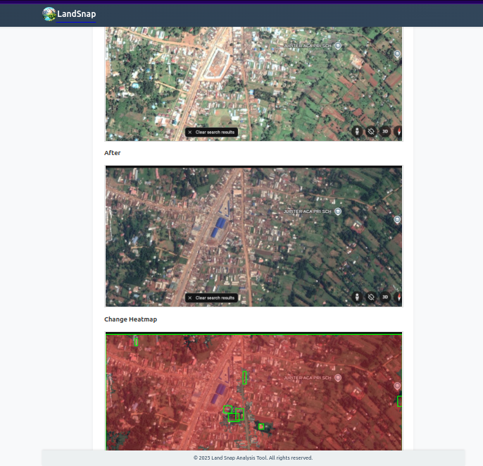

# LandSnap

LandSnap is a Django-based web application designed to analyze land changes over time using comparative image analysis. It leverages advanced computer vision algorithms to detect and visualize differences between two aerial images of the same location taken at different times.

## Features

- **Image Upload**: Upload two images of the same location for analysis.
- **Change Detection**: Identify changes in terrain, vegetation, and structures.
- **Heatmap Visualization**: View detailed analysis results with heatmap overlays.
- **Responsive Design**: User-friendly interface optimized for various devices.

## Project Structure

```
landsnap/
├── core/                # Core Django project settings and configurations
├── landsnap/            # Main application containing models, views, templates, and utilities
│   ├── templates/       # HTML templates for the application
│   ├── static/          # Static files (CSS, JS, images)
│   ├── migrations/      # Database migrations
│   ├── utils/           # Utility functions and helpers
├── media/               # Uploaded media files
├── static/              # Compiled static files
├── db.sqlite3           # SQLite database file
├── manage.py            # Django management script
├── .env                 # Environment variables
├── requirements.txt     # Python dependencies
└── README.md            # Project documentation
```

## Installation

1. **Clone the Repository**:
   ```bash
   git clone https://github.com/MeFerdi/landsnap.git
   cd landsnap
   ```

2. **Set Up a Virtual Environment**:
   ```bash
   python -m venv myenv
   source myenv/bin/activate  # On Windows: myenv\Scripts\activate
   ```

3. **Install Dependencies**:
   ```bash
   pip install -r requirements.txt
   ```

4. **Configure Environment Variables**:
   Create a `.env` file in the project root and configure the following variables:
   ```properties
   DEBUG=True
   SECRET_KEY=your-random-secret-key
   DB_ENGINE=django.db.backends.sqlite3
   DB_NAME=db.sqlite3
   STATIC_URL='/static/'
   MEDIA_URL='/media/'
   ```

5. **Apply Migrations**:
   ```bash
   python manage.py migrate
   ```

6. **Run the Development Server**:
   ```bash
   python manage.py runserver
   ```

7. **Access the Application**:
   Open your browser and navigate to `http://127.0.0.1:8000`.

## Usage

1. Navigate to the **Upload** page to upload two images of the same location.
2. Wait for the system to process the images and generate results.
3. View the analysis results, including heatmap visualizations, on the **Results** page.

## Development

### File Structure

- **Templates**: Located in `landsnap/templates/landsnap/`, these define the HTML structure of the application.
- **Static Files**: CSS, JavaScript, and images are stored in `landsnap/static/landsnap/`.
- **Environment Variables**: Configured in the `.env` file for flexibility between development and production environments.

## Screenshot of Result page
